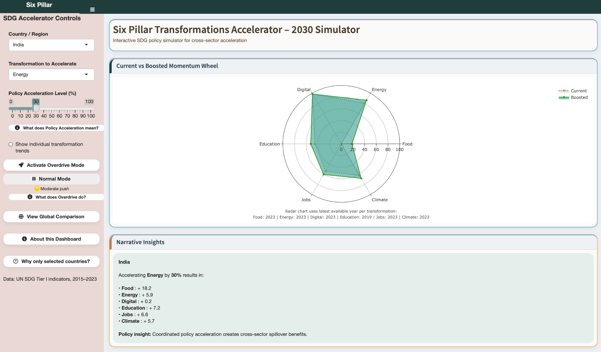
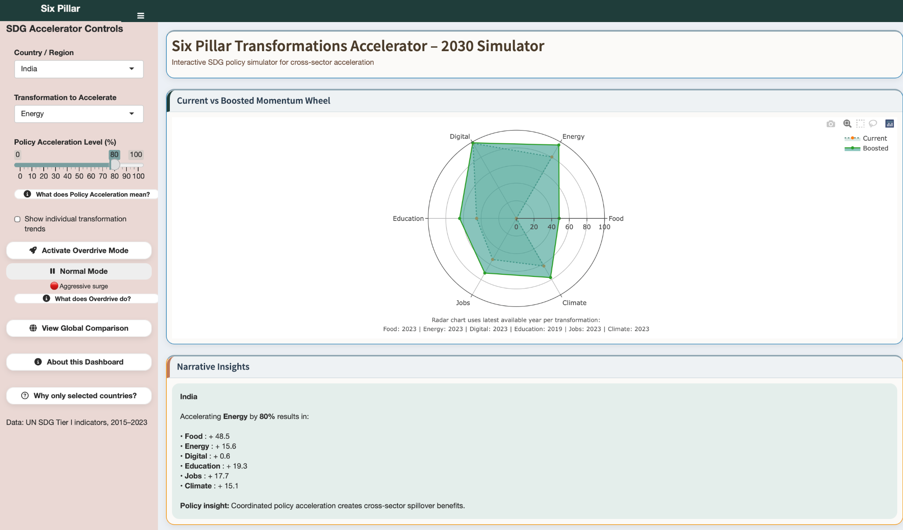
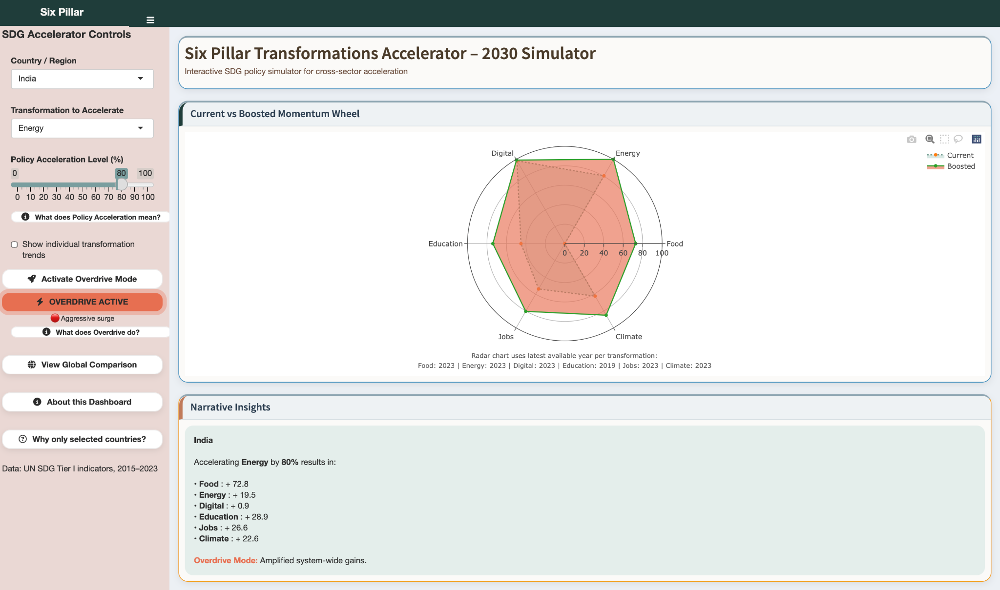
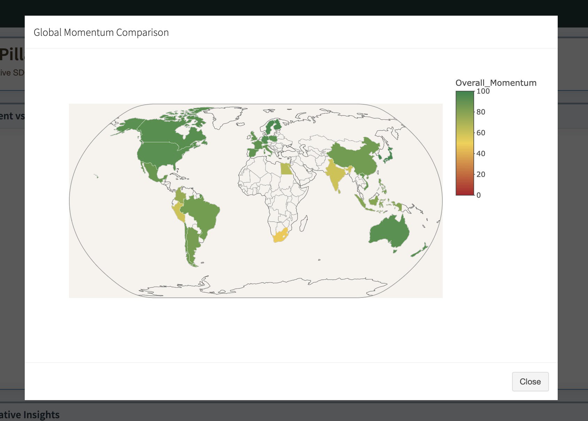

# Six Pillar Transformations Accelerator – 2030 Simulator

An interactive R Shiny analytics dashboard for evaluating SDG progress through composite scoring, correlation-based spillover analysis, and 2030 policy scenario simulations.

## Project Overview

The Six Pillar Transformations Accelerator is an interactive, policy-oriented dashboard designed to explore progress across six interconnected SDG transformation areas.

The dashboard combines selected SDG indicators into transformation-level scores and an overall momentum score. Users can select a country, examine individual transformation areas, apply a policy acceleration scenario, and explore potential cross-sector spillover effects.

The dashboard is designed as an exploratory scenario-analysis tool rather than a predictive forecasting model.

## Six Transformation Areas

- Food Systems
- Energy Access
- Digital Transformation
- Education
- Jobs and Social Protection
- Climate and Biodiversity

## Data

The analysis uses selected Tier I SDG indicators covering the period 2015–2023.

Primary data sources include:

- UN SDG Global Database
- World Bank data for greenhouse gas emissions where observations in the UN SDG dataset were sparse

## Analytical Methodology

The analysis follows a multi-stage analytical workflow:

1. Data preparation and cleaning
2. Missing-data handling
3. Direction-aware percentile normalization of indicators
4. Construction of transformation-level composite scores
5. Calculation of an Overall Momentum Score
6. Pearson correlation analysis across transformation areas
7. Correlation-based spillover modelling
8. Policy acceleration simulation
9. 2030 base and accelerated scenario comparison

Indicators within transformation areas are aggregated using equal weighting, with the overall momentum score constructed from the transformation-level scores.

## Interactive Features

### Transformation Analysis

Users can select a country and transformation area to examine transformation-level performance and historical trends.

### Policy Acceleration

A policy acceleration slider allows users to simulate an improvement in a selected transformation and examine the resulting change in the transformation scores.

### Cross-Sector Spillovers

The dashboard incorporates correlation-based relationships between transformation areas to explore potential spillover effects from accelerating one transformation.

### Overdrive Mode

Overdrive Mode represents a higher-coordination scenario in which the strength of policy transmission is amplified across transformation areas.

### Global Comparison

The dashboard provides a global comparison of Overall Momentum scores using the latest available observations.

### 2030 Scenario Analysis

Historical momentum trends are extended toward 2030 and compared with an accelerated scenario under the selected policy assumptions.

## Dashboard Preview

### Dashboard Overview



### Policy Acceleration Scenario



### Overdrive Mode



### Global Comparison



## Tools & Technologies

- R
- R Shiny
- shinydashboard
- dplyr
- Plotly
- shinyalert
- jsonlite

## Live Dashboard

**Interactive Dashboard:**  
[Open the Six Pillar Transformations Accelerator] https://m2024bsass003.shinyapps.io/sdgaccelarator/ 
## Repository Structure

## Repository Structure

```text
sdg-policy-accelerator/
│
├── app.R
├── sdg_prepared.rds
├── correlation_groups.rds
│
├── report/
│   └── SDG_Dashboard_Report.pdf
│
└── screenshots/
    ├── dashboard_overview.png
    ├── policy_acceleration.png
    ├── overdrive_mode.png
    └── global_comparison.png
```
## Limitations
This dashboard is intended for exploratory scenario analysis and should not be interpreted as a predictive forecasting model.
The spillover framework uses Pearson correlations to represent statistical associations between transformation areas. These relationships should not be interpreted as evidence of causality.
Results are also subject to assumptions relating to indicator selection, missing-data treatment, percentile normalization, equal weighting, and scenario parameters.
The 2030 scenarios represent simulated outcomes under specified assumptions and should not be interpreted as forecasts.

## Project Report
The detailed methodology, analytical framework, assumptions, results, and limitations are documented in the project report available in the report/ directory.

## Author
Aditi Ranjan
BS Analytics & Sustainability, TISS

